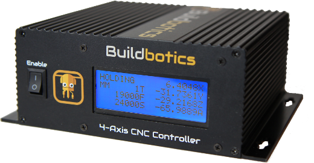
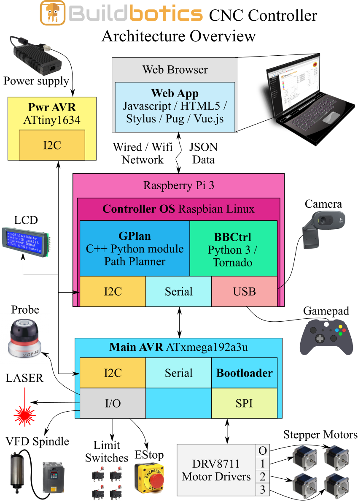

# Buildbotics CNC Controller Firmware
This repository contains the source code for the Buildbotics CNC Controller.
See [buildbotics.com](https://buildbotics.com/) for more information.

## Overview

The main parts of the Buildbotics CNC Controller software and the technologies
they are built with are as follows:

 * Web App - Frontend user interface
   * [Javascript](https://www.w3schools.com/js/)
   * [HTML5](https://www.w3schools.com/html/)
   * [Stylus](http://stylus-lang.com/)
   * [Pug.js](https://pugjs.org/)
   * [Vue.js](https://vuejs.org/)

 * Controller OS - RaspberryPi Operating System
   * [Raspbian](https://www.raspbian.org/)

 * BBCtrl - Python App
   * [Python 3](https://www.python.org/)
   * [Tornado Web](https://www.tornadoweb.org/)

 * CAMotics - Path Planner Python Module
   * [C++](http://www.cplusplus.com/)
   * [CAMotics](https://camotics.org/)

 * Main AVR Firmware + Bootloader - Real-time step generation, etc.
   * [ATxmega192a3u](https://www.microchip.com/wwwproducts/ATxmega192A3U)
   * [C](https://en.wikipedia.org/wiki/C_(programming_language))

 * Pwr AVR Firmware - Power safety
   * [ATtiny3216](https://www.microchip.com/wwwproducts/ATtiny3216)
   * [C](https://en.wikipedia.org/wiki/C_(programming_language))

## Quickstart Guide

Be sure to read the [development guide](docs/development.md) for more detailed
instructions.

On a Debian Linux (9.6.0 stable) system:

    # Install the required packages
    sudo apt-get update
    sudo apt-get install -y build-essential git wget binfmt-support qemu \
      parted gcc-avr avr-libc avrdude pylint3 python3 python3-tornado curl \
      unzip python3-setuptools
    curl -sL https://deb.nodesource.com/setup_11.x | sudo -E bash -
    sudo apt-get install -y nodejs

    # Get the source
    git clone https://github.com/buildbotics/bbctrl-firmware

    # Build the Firmware
    cd bbctrl-firmware
    make pkg

The resulting package will be a ``.tar.bz2`` file in ``dist``.  See the
[development guide](docs/development.md) for more information.

## License
Copyright Buildbotics LLC 2016-2021.

This source describes Open Hardware and is licensed under the CERN-OHL-S v2

You may redistribute and modify this documentation and make products
using it under the terms of the CERN-OHL-S v2 (https:/cern.ch/cern-ohl).
This documentation is distributed WITHOUT ANY EXPRESS OR IMPLIED
WARRANTY, INCLUDING OF MERCHANTABILITY, SATISFACTORY QUALITY
AND FITNESS FOR A PARTICULAR PURPOSE. Please see the CERN-OHL-S v2
for applicable conditions.

Source location: https://github.com/buildbotics

As per CERN-OHL-S v2 section 4, should You produce hardware based on
these sources, You must maintain the Source Location clearly visible on
the external case of the CNC Controller or other product you make using
this documentation.
